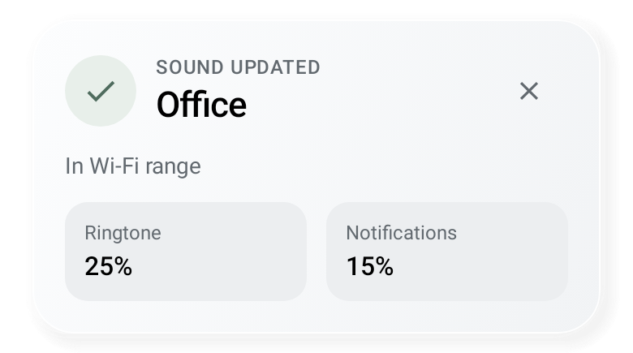
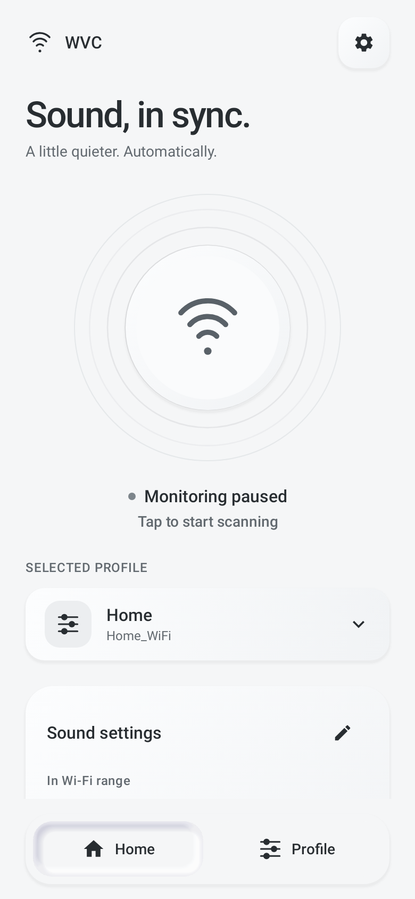
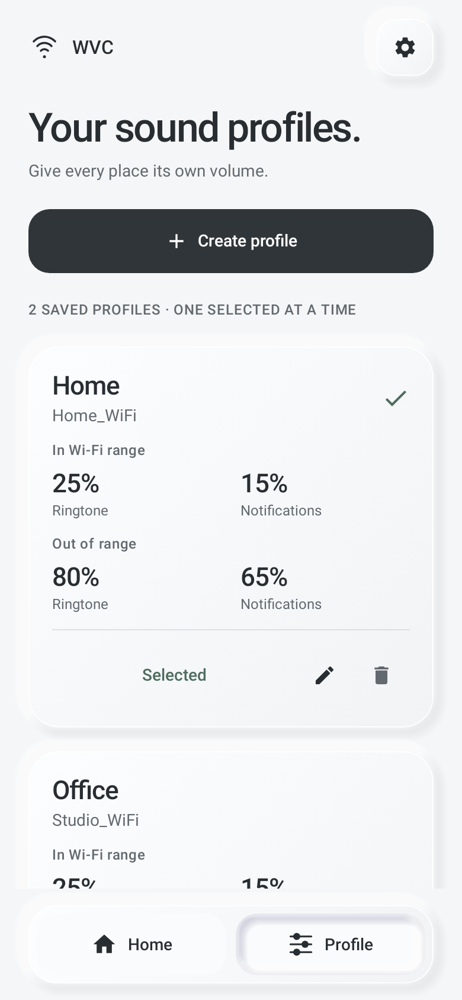
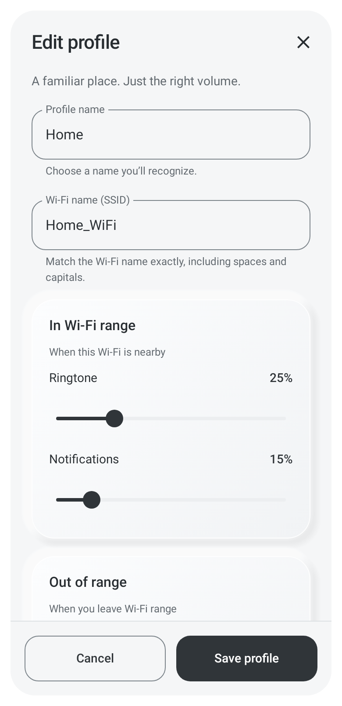
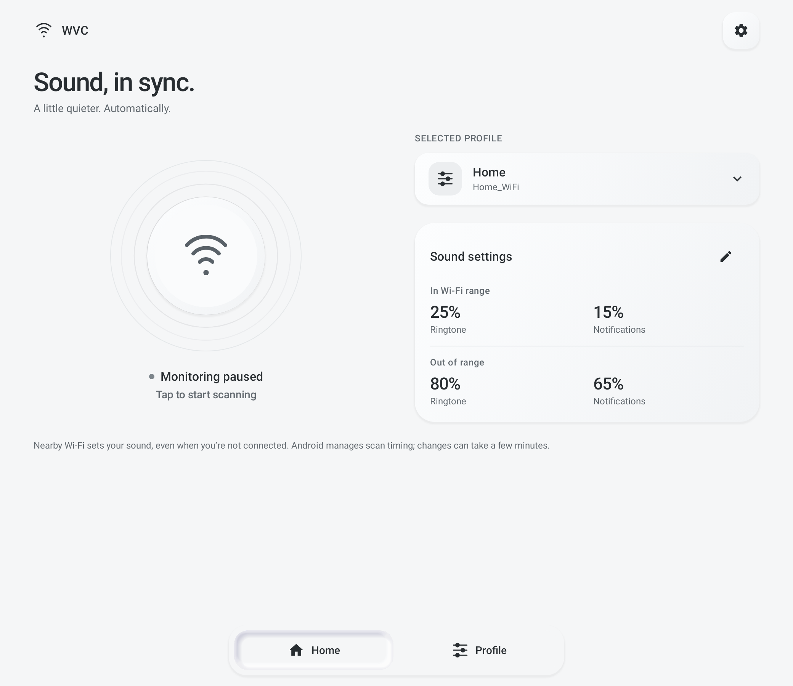
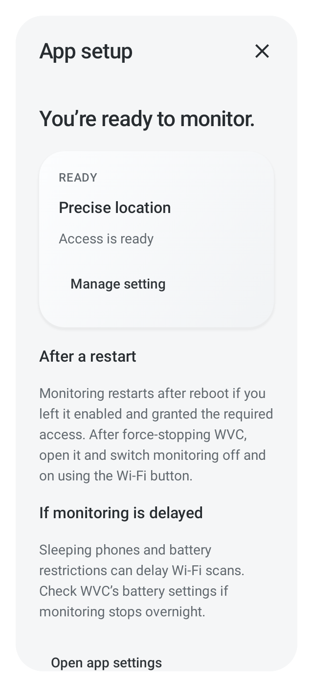

# WVC · white interface

The app has two tabs, **Home** and **Profile**, each with an icon. The same bottom
navigation stays available on phones and tablets.

## Home

- A large, sculpted Wi-Fi indicator with three gently expanding waves.
- Explicit monitoring status and Start/Stop/Resume controls. The waves represent
  enabled monitoring, not a promise of continuous or successful radio scans.
- A profile picker directly on Home. Selection closes the picker and updates the
  saved active profile; the service applies volumes after a fresh scan.
- In-range and out-of-range ringtone/notification summaries, with an edit action.
- A setup button opens permission readiness, Android settings links, and
  reboot/battery guidance without adding a third tab.

## Profile

Create, edit, rename, select, and delete saved sound profiles. The editor includes
an exact Wi-Fi name and separate ringtone/notification levels in and out of range.

Edits remain drafts until Save. Duplicate or blank names and invalid SSIDs show
inline errors. Drafts survive recreation, and modified drafts require confirmation
before discarding. Deleting the selected profile requires confirmation and stops
monitoring. Legacy profiles and saved settings are retained.

## Visual and motion design

The app intentionally stays light, including when Android uses dark mode. Soft
white surfaces, opposing diffuse shadows, charcoal controls, and restrained sage
status accents replace the blue theme. All shadows use ordinary drawing primitives
supported from Android 8, without software rendering or bitmap assets.

Tab changes crossfade, profile summaries resize smoothly, and the Home profile
control responds to a press. Wi-Fi waves run only while monitoring is enabled,
Home is visible, no overlay is open, and the activity is resumed. They stop when
Android's **Remove animations** setting is enabled, including live changes. Other
Compose animations follow the system duration scale.

Content stacks on small windows and enlarged text. Wider windows show Home in two
columns and paired profile cards. The editor scrolls independently of its fixed
Save/Cancel actions. System bars use dark icons to match the white appearance.
Text labels, selected tab/radio semantics, meaningful icon descriptions, and
48 dp or larger action targets remain available to accessibility services.

## Profile-change popups

Selecting a different profile shows a white, softly raised **Profile selected**
popup. It explains whether WVC is waiting for a fresh scan or for monitoring to
start. It never claims the new volumes have already been applied.

After the monitoring service successfully applies a profile, an animated
**Sound updated** popup shows the profile name, Wi-Fi range state, and its
ringtone/notification percentages. It has a close button and dismisses after six
seconds, extended by Android accessibility timeout preferences. A newer update
replaces the previous popup and starts a fresh timer. It appears above an open
profile editor without taking keyboard focus.

When WVC is in the background, the same confirmed change uses Android's native
notification template on a separate **Sound profile changes** channel. It is
configured for on-screen popups, without sound or vibration by default. Tapping
it opens WVC; it clears after a minute. Android, Do Not Disturb, and the user's
channel settings control actual heads-up display. **App setup → Profile change
popups** opens the relevant permission/channel settings. Lock-screen public
content omits the profile name and volume details.

Repeated scans and unchanged service restarts do not generate repeat alerts.
Blocked/deferred changes do not announce success. In-app events are not replayed
when the app reopens, and a change uses either the in-app popup or a system
notification. The ongoing monitoring notification remains separate.

Android references: [notification channels](https://developer.android.com/develop/ui/views/notifications/channels)
and [notification templates](https://developer.android.com/develop/ui/views/notifications/custom-notification).

## Native previews



Generated from real Compose views with Robolectric native graphics and sample
profiles. These are not physical-device screenshots.

| Home | Profiles | Editor |
| --- | --- | --- |
|  |  |  |





## Checks

Run with JDK 21:

```sh
bash gradlew :app:testDebugUnitTest :app:lintDebug :app:assembleDebug
```

The debug APK builds, lint reports zero errors, and all 35 tests pass, including 16 UI tests. The test suite includes notification routing, repeat suppression, permissions,
confirmed service changes, DND deferral, popup dismissal, and replacement timing.
The UI tests cover a 390 dp phone, a 1040 dp tablet with system dark mode, and a
320 dp window at 160% text size. They exercise profile selection from Home,
creation/editing, validation, restored drafts, discard/delete confirmation, both
tabs, setup access, and Stop with missing permissions. A frame comparison verifies
that Wi-Fi waves move while enabled and settle when paused.

GitHub's SDK setup explicitly requests `platform-tools`: the action's old default
also requested Google's retired `tools` package and failed before compilation.
Command-line tools are pinned to the same version used for local validation.

Physical-device IME, TalkBack, overnight Wi-Fi scanning, and reboot checks remain
in the [compatibility checklist](ANDROID_COMPATIBILITY.md).
