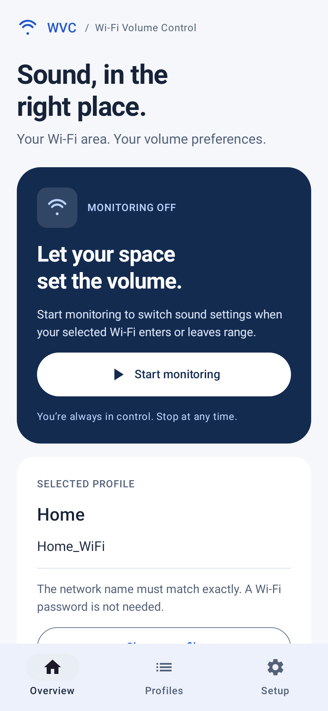
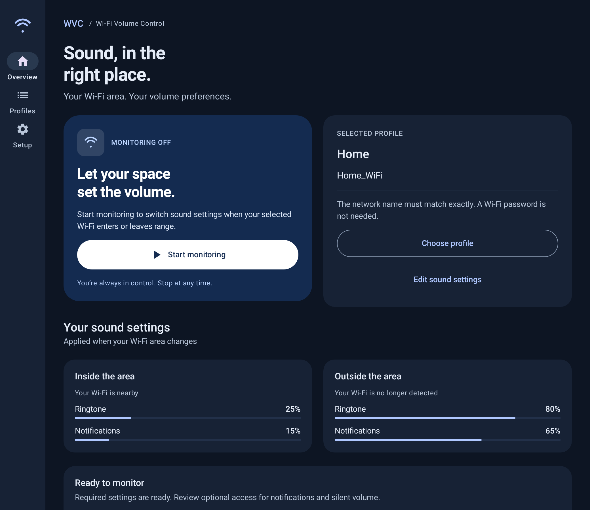

# WVC interface redesign

WVC now has three focused screens instead of one long settings form:

- **Overview:** monitoring status, Start/Stop/Resume, the selected Wi-Fi profile,
  inside/outside volume summaries, and setup guidance.
- **Profiles:** create, edit, rename, select and delete saved places. One profile
  is selected at a time. The first profile is selected automatically.
- **Setup:** current permission and system-setting status, required versus optional
  access, direct Android settings links, and reboot/battery guidance.

## Interaction fixes

- Profile edits are drafts with explicit Save/Cancel. Typing a partial Wi-Fi name
  or moving a slider no longer changes the running service's saved settings.
- Drafts and the selected screen survive activity recreation. Back and Cancel
  ask before discarding modified drafts; Back from a secondary screen returns to Overview.
- Duplicate names (including capitalization/outer whitespace), blank names,
  blank SSIDs, and SSIDs exceeding 32 UTF-8 bytes produce inline validation.
  SSID spaces and capitalization are preserved because network names are exact.
- Renaming a selected profile preserves its selection. Saving a different profile
  does not unexpectedly activate it.
- Deleting the selected profile stops monitoring and clears its legacy snapshot;
  it cannot reappear as a fallback profile. Other profiles remain untouched.
- The original single-profile configuration migrates once into a Home profile.
- UI state is activity-owned rather than process-global Compose state. Service
  updates and returning from Android Settings refresh the visible status.
- Stop remains available when permissions are missing. Queued scan callbacks
  also check the persisted enable flag before changing sound.
- Monitoring is labelled **enabled**, not guaranteed to be running. Android can
  suspend work; the service status and Resume action explain how to recover.

## Layout and accessibility

A consistent blue Material 3 theme follows the system's light/dark appearance.
Phones use bottom navigation; windows at least 840 dp wide use a navigation rail.
Cards and editor controls use two columns when there is sufficient width, and
stack when the window is narrow or text is enlarged. Content scrolls, the editor's
Save/Cancel controls stay visible, and system-bar/keyboard insets are respected.
Buttons have labelled actions and minimum touch heights; sliders announce both
the sound stream and inside/outside context. The old continuously pulsing spinner
has been removed.

## Preview renders

These are native Compose renders from JVM UI tests using sample profile data,
not screenshots from physical devices. The editor body scrolls independently
from its persistent action buttons.

### Phone overview



### Profile editor


### Tablet, dark theme



### Compact screen with enlarged text


## Validation

The suite includes 18 tests: 3 presence-state regressions, 6 profile-storage and
validation tests, 8 Compose interaction/render tests, and the existing sample test.
The UI tests exercise a 390 dp phone, 1040 dp tablet in dark mode, and a 320 dp
compact screen at 160% text size. They cover Save validation, draft restoration,
discard confirmation, navigation, empty states, and Stop with missing permissions.

Run with JDK 21:

```sh
bash gradlew :app:testDebugUnitTest :app:lintDebug :app:assembleDebug
```

Reports and generated preview images are in `app/build/reports/`. Real-device
IME, TalkBack, overnight Wi-Fi scanning and reboot checks remain necessary;
see [the compatibility checklist](ANDROID_COMPATIBILITY.md).
